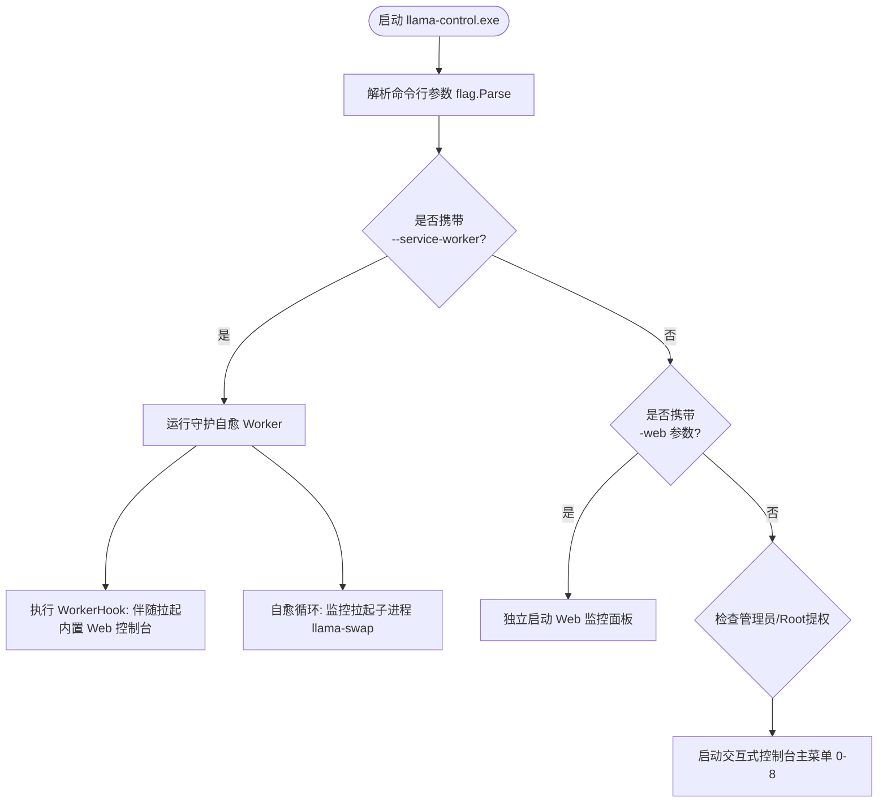

# LlamaControl 项目全景知识库与 AI 协作规范

> [!IMPORTANT]
> **AI 协同维护强制协议 (AI Synchronization Protocol)**：
> 凡是在后续会话中对本项目的**业务逻辑、接口设计、架构目录、构建配置、运行模式或依赖项**做出任何增删改的 AI 助手，**必须在完成代码修改后，主动同步更新 `.agent/` 目录下的相关文档**。严禁出现代码已改动但文档滞后陈旧的情况。任何新开对话的 AI 助手，均应优先阅读本文档以获取项目上下文。

---

## 一、项目定位与核心价值

**LlamaControl** 是一个专为本地大模型服务生态（特别是 [llama-swap](https://github.com/mostlygeek/llama-swap) 与 [llama.cpp](https://github.com/ggml-org/llama.cpp)）量身定制的**轻量级、跨平台、零外部依赖**的系统运维管理与控制工具。

### 核心能力特性
1. **系统原生服务托管与自愈守护**：
   - **Windows**：基于原生 Win32 Service Manager API (`golang.org/x/sys/windows/svc`) 注册并托管为系统服务，摆脱批处理与脆弱的外挂脚本。
   - **macOS**：原生生成并托管 Launchd 守护配置 (`LaunchAgents/com.<service>.plist`)。
   - **自愈机制**：后台 Worker 自动监控子进程健康，异常闪退 3 秒后自动拉起。
2. **零 CDN 依赖的内置 Web 监控面板**：
   - 随系统守护服务一同启动（WorkerHook），也可作为独立进程运行 (`-web`)。
   - 前端资产（HTML / 单文件暗色样式表 `style.css`）使用 `go:embed` 完全编译进单一二进制文件中，**天然支持离线无外网机房部署**。
   - 内置反向代理：
     - `/swap/ui` 前缀透明剥离与重定向重写，无缝嵌入 llama-swap 原生热切换面板。
     - `/v1/*`、`/ui/*` 直连路由透传，上游请求统一对齐目标 `Host` 请求头。
   - 状态查询与网络 I/O 彻底解耦：高频轮询接口毫秒级返回本地内存状态，彻底规避 GitHub API 速率限制。
3. **安全配置解析 (Safe Config Parsing)**：
   - 引入 `gopkg.in/yaml.v3` 规范解析 `config.yaml` / `config.yml`。
   - 深度防御：严密拦截 `.` 根目录穿透，杜绝日志清理时误伤工作区文件。
4. **单应用/全局热更新与下载容错**：
   - 支持独立升级 `llama.cpp` 或 `llama-swap`，支持指定版本或强制覆盖重装。
   - 集成 `https://ghproxy.net/` 镜像加速自动降级重试。
   - 双层文件锁防御：`waitForServiceStopped` 轮询等待系统服务退出 + `retryRename` 规避 Windows 下内核/防病毒软件的微秒级句柄占用。
   - 下载截断校验与残缺文件自动清理机制。
5. **日志管理**：
   - `DailyLogWriter` 按自然日自动分片切分日志文件（`swap-YYYY-MM-DD.log`）。
   - `readTailLines` 采用倒序 Seek + 8KB 分块分步反向读取大日志尾部，内存恒定极小，杜绝大日志 OOM。
   - `CleanLogs` 安全清理过期日志。

---

## 二、代码库目录结构与模块说明

```
d:\Projects\Go\LlamaControl
├── .agent/                         # AI 持久化知识库与项目全局上下文（本目录）
│   └── README.md                   # 核心架构、运行模式与 AI 维护规范
├── cmd/
│   └── llama-control/
│       └── main.go                 # 主入口：命令行 Flag 解析、控制台交互菜单、伴随 Web 服务挂载
├── internal/
│   ├── config/                     # 配置解析模块
│   │   ├── swap.go                 # 基于 yaml.v3 提取端口与安全日志目录
│   │   └── swap_test.go            # 端口格式、YAML 锚点引用及安全防御单测
│   ├── fsutil/                     # 文件与日志工具模块
│   │   ├── archive.go              # 解压 (zip/tar.gz/tgz) 与带重试的原子替换 ReplacePackageSafely
│   │   └── log.go                  # 每日日志切片写入 (DailyLogWriter) 与过期日志安全清理
│   ├── platform/                   # 跨平台系统抽象模块
│   │   ├── platform.go             # 服务 Worker 守护自愈、WorkerHook、服务管理交互向导、硬件变体探测
│   │   ├── windows.go              # Windows SCM 原生服务注册与系统 API (svc/mgr)
│   │   ├── windows_test.go         # PATH 空格解析与 CUDA 环境变量探测单测
│   │   ├── darwin.go               # macOS Launchd (plist) 服务托管与启停实现
│   │   └── other.go                # Linux/其他平台兼容桩代码
│   ├── updater/                    # 自动更新与资产管理模块
│   │   ├── client.go               # GitHub Release 拉取、带进度条下载、镜像重试与残损清理
│   │   ├── updater.go              # 资产打分 (assetScore)、单应用升级 (UpdateAppByName)、文件占用轮询
│   │   ├── updater_test.go         # 架构互斥、下载中断自动清理单测
│   │   ├── version.go              # 变体识别、SemVer 语义化版本解析与比对
│   │   └── version_test.go         # 版本提取与比对单测
│   └── web/                        # 内置 Web 控制面板与反向代理模块
│       ├── assets.go               # go:embed 静态资源挂载 (AssetsHandler)
│       ├── assets/                 # 前端源文件
│       │   ├── index.html          # 单页应用仪表盘 (概览、Swap 原生 iframe、实时日志、应用升级)
│       │   └── style.css           # 纯手写 10KB 紧凑暗色主题 (完全脱离外部 Tailwind CDN)
│       ├── server.go               # HTTP 路由、ReverseProxy 反代、运维 REST API、readTailLines
│       └── server_test.go          # 反代路由剥离、端口冲突避让、日志逆向读取单测
├── scripts/
│   └── build.ps1                   # 多架构发布构建脚本 (生成 zip 与 sha256 校验和)
├── go.mod                          # Go 模块定义 (Go 1.22+)
└── go.sum                          # 模块哈希校验和
```

---

## 三、系统运行模式与工作链路



### 1. 运行模式详解
1. **交互式控制台菜单（默认启动）**：
   - 执行 `llama-control.exe`。
   - 提供 0~8 号功能：服务启停/重启、状态查看、日志清理、应用更新、服务注册向导，以及控制台内一键挂载 Web 监控面板。
2. **原生服务 Worker 守护模式（`--service-worker`）**：
   - 由操作系统服务管理器（Windows SCM / macOS Launchd）唤醒。
   - 自动在后台拉起并监督 `llama-swap` 进程，崩溃时 3 秒自动拉起。
   - 通过 `WorkerHook` 同时挂载轻量级 Web 控制台（默认监听 `127.0.0.1:11452`），使服务后台运行时依然具备可视化的 Web 监控能力。
3. **独立 Web 面板模式（`-web`）**：
   - 执行 `llama-control.exe -web [-web-addr=127.0.0.1:11452]`。
   - 专为无桌面服务器或习惯使用浏览器管理的用户设计，直接进入 HTTP 监听。

### 2. 命令行参数 (Flags)
| 参数名 | 默认值 | 作用说明 |
| :--- | :--- | :--- |
| `-service` | `llama-swap` | 目标系统服务名称（亦可通过环境变量 `LLAMA_SERVICE_NAME` 设置） |
| `-service-worker` | `false` | 系统服务 Worker 守护进程标记（由服务管理器自动传入） |
| `-web` | `false` | 以纯 Web 控制面板模式运行 |
| `-web-addr` | `127.0.0.1:11452` | Web 控制面板监听地址（若与 swap 冲突且非用户显式传入，会自动 +1 避让） |

---

## 四、核心 API 路由清单 (Web Server)

| 路由地址 | 请求方法 | 路由性质 | 作用说明 |
| :--- | :---: | :--- | :--- |
| `/` 或 `/index.html` | GET | 静态资源 | 返回内嵌的 Web 监控仪表盘单页 |
| `/style.css` | GET | 静态资源 | 返回内嵌的独立离线暗色样式表 |
| `/swap/` 或 `/swap/ui` | ANY | 反向代理 | 剥离 `/swap` 前缀，透明反代至本地 `llama-swap` 实例 |
| `/v1/*` | ANY | 直通反代 | 将 OpenAI 兼容的模型推理请求直传至本地 `llama-swap` |
| `/ui/*`、`/running` | ANY | 直通反代 | `llama-swap` 原生 Web UI 资源与运行状态直传 |
| `/api/status` | GET | 运维 API | 毫秒级返回当前平台、服务状态、监听端口、日志目录及应用版本 |
| `/api/service/{action}` | POST | 运维 API | 执行服务控制：`start` / `stop` / `restart` |
| `/api/logs` | GET | 运维 API | 倒序分块读取最新日志文件的最后 150 行（防 OOM） |
| `/api/logs/clean` | POST | 运维 API | 清空过期日志文件 |
| `/api/apps/check` | POST | 运维 API | 主动请求 GitHub API 刷新受管组件的最新版本缓存 |
| `/api/apps/update` | POST | 运维 API | 安全升级指定应用：带并发互斥锁、服务暂停等待与原子回滚 |

---

## 五、关键设计决策与避坑指南 (Gotchas & Antipatterns)

在维护或拓展本项目时，所有 AI 助手必须注意以下技术红线：

1. **绝对禁止退化为正则匹配 YAML**：
   - 必须使用 `gopkg.in/yaml.v3` 解析配置文件。
   - `EffectiveLogDir` 提取出的目录如果等于 `.` 或为空，**必须坚决拦截判定为无效**，严禁向外输出 `.`，否则会使 `CleanLogs` 面临清空工作目录/项目源码的高危风险。
2. **Windows 替换文件前必须确认句柄释放与重试**：
   - 停止 Windows 系统服务后，服务主进程退出并释放 `.exe` / `.dll` 句柄存在时间差。
   - 更新或替换文件必须调用 `waitForServiceStopped` 轮询确认服务彻底停止，并在 `ReplacePackageSafely` 中使用 `retryRename`（5次重试，每次200ms）应对瞬时文件锁。
3. **反向代理的 `Host` 头对齐**：
   - 使用 `httputil.NewSingleHostReverseProxy` 时，默认 Director 不会更改 `req.Host`。
   - 必须显式重写 `req.Host = targetURL.Host`，否则某些上游应用因 Host 校验失败会返回 400 或死循环重定向。
4. **前端离线化红线**：
   - 严禁在 `internal/web/assets/index.html` 中引入任何外部第三方 CDN 资源（如 `cdn.tailwindcss.com`、外部字体等）。
   - 所有样式与图标必须以纯 CSS/本地内嵌方式实现，确保单机、无外网环境下仪表盘完全正常可用。
5. **下载异常清理原则**：
   - `DownloadWithProgress` 必须确保在发生任何错误（如网络断开、截断、非 200 响应）时，自动执行 `os.Remove(path)` 清理破损的中间文件。

---

## 六、开发、测试与验证基线

每次代码修改必须通过以下三道检验：

```powershell
# 1. 强制无缓存全量单测通过
go test -count=1 ./...

# 2. 静态语法与类型合规检查
go vet ./...

# 3. 跨平台编译兼容性验证（严禁因平台特定 API 破坏非目标平台的编译）
$env:GOOS="darwin"; go vet ./...; $env:GOOS="linux"; go vet ./...; $env:GOOS="windows"
```
